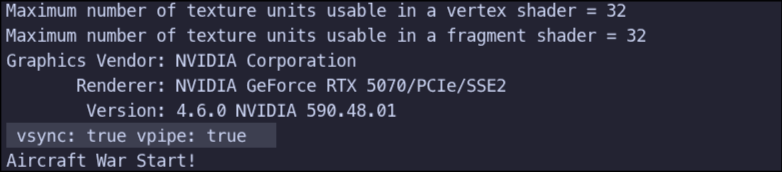
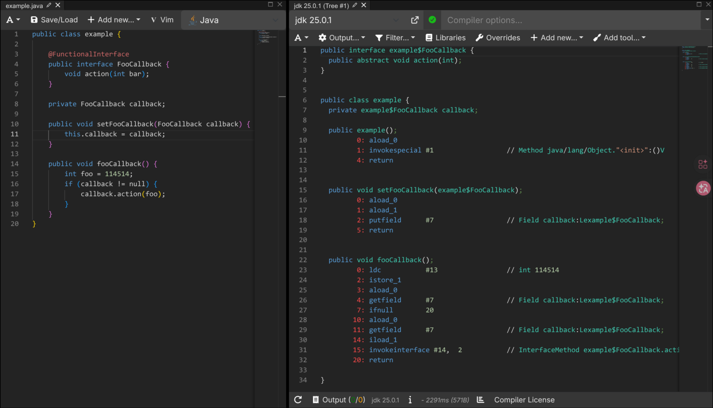

## JavaFX 简介

Swing 诞生于 1998 年。JavaFX 是 2008 年之后逐步发展起来的一代 GUI 框架。相对于swing，它丢掉了很多历史包袱，这也导致了相比swing，JavaFX 有着一些可观优点。

先说最核心的一点：渲染架构。

Swing 的绘制模型是基于 AWT 的轻量级组件体系，核心是 CPU 绘制，虽然可以选择使用GPU，但是核心抽象并非围绕 GPU 设计。
JavaFX 则是基于 Prism 图形引擎，支持硬件加速。底层可以走 DirectX、OpenGL，没有成功调用才会软件 fallback，从设计之初就考虑 GPU。

再者，实现样式除了使用Canvas，JavaFX 还支持 CSS。

Swing 没有真正的样式系统。想改外观就要改 UIManager 或者写自定义 UI delegate。而JavaFX 支持类 CSS 的样式表。以一个button举例：

```java
Button btn = new Button("Launch");
btn.getStyleClass().add("launch-button");
```

其中赋予了这个按钮的CSS类名。然后使用css文件书写属性：

```css
.launch-button {
    -fx-background-color: linear-gradient(to bottom, #00c6ff, #0072ff);
    -fx-text-fill: white;
    -fx-font-size: 16px;
    -fx-font-weight: bold;
    -fx-background-radius: 8;
    -fx-padding: 8 16 8 16;
}
```

然后在应用里面加载：

```java
scene.getStylesheets().add(
    getClass().getResource("/style.css").toExternalForm()
);
```

再说媒体和动画。

Swing 本身没有与 GUI 框架深度集成的媒体播放组件（音频通常用 Java Sound，视频往往依赖第三方/平台方案）。
JavaFX 内建 MediaPlayer、时间轴动画（Timeline）、关键帧系统。

动画在 JavaFX 里是语言级能力。在 Swing 里是 Timer + repaint + 自己算时间。所以可以更加方便的实现游戏 tick 与 render rate 的分离。

线程模型方面，两者都是单线程 UI，但 JavaFX 的 Task、Service 更现代。
它把后台任务和 UI 更新的桥接设计得更系统化。

**众多优势例如3D等我们几乎用不到，而且用javaFX写这样简单的游戏几乎是“大炮打蚊子”，这不是为了炫耀马力，而是对时间、渲染、线程、架构的掌控能力，当打开 `-Dprism.verbose=true` ，看到 OpenGL shader 被创建，突然意识到自己“作业级小游戏”已经在驱动显卡。这个瞬间很有价值。**

当然，如果目标只是交作业、得分、赶进度，还是劝退去使用swing吧。

在书写代码中请多多参考文档：

[FXDocs](https://fxdocs.github.io/docs/html5/)\
[Jenkov.com](https://jenkov.com/tutorials/javafx/index.html)


## JavaFX 线程

JavaFX 的线程模型不复杂，但它非常严格。本质上就是一条铁律：UI 只能由 FX Application Thread（FX 线程）修改。不可越界。

从结构讲起。

JavaFX 运行时通常至少有三个重要线程角色：
第一是 FX Application Thread，也就是所谓的 FX 线程。它负责所有 UI 相关的工作——事件处理、布局计算、场景图（Scene Graph）修改、渲染调度。
第二是后台线程（你自己 new Thread、线程池、ExecutorService 等）。
第三是媒体相关线程，比如音频、视频解码线程（由 JavaFX Media 模块内部管理）。

一切问题，都源于一个事实：Scene Graph 不是线程安全的。

当在后台线程里直接修改 UI，比如：

```java
label.setText("done");
```

如果这个调用发生在非 FX 线程上，就可能抛出：


```text
Exception in thread "Thread-*" java.lang.IllegalStateException: Not on FX application thread; currentThread = Thread-*
    at com.sun.javafx.tk.Toolkit...
    at com.sun.javafx.tk.quantum...
```

为何如此？因为 JavaFX 的 Scene Graph 设计成单线程访问模型。原因很现实：如果允许多线程同时改 UI，需要大量锁，代价是性能下降和复杂性暴增。UI 框架通常选择单线程模型，这是经典权衡。

在非 FX 线程对 UI 进行修改，就需要用到 `Platform.runLater()`，其作用是把一段代码“投递”到 FX 线程的事件队列里。等 FX 线程空下来，就会执行这段代码。

如后台线程完成任务后，需要更新UI:

```java
new Thread(() -> {
    String result = longTask();
    Platform.runLater(() -> label.setText(result));
}).start();
```

在 FX 线程中调用重型计算任务是不明智的，解决方案往往是如上在新的线程里面进行计算任务然后使用 `runLater` 进行 UI 刷新。以及在回调里启动后台线程处理重任务，再用 `runLater` 更新 UI。

再深入一点。FX 线程的本质是一个事件循环（event loop）。它每一帧大致做：

- 处理输入事件
- 处理 runLater 队列
- 布局
- CSS 计算
- 渲染

这也是为什么在 FX 线程里阻塞（比如 Thread.sleep 或长时间计算），整个 UI 就会冻结，因为事件循环停住了。

网络请求、大文件 IO 、CPU 密集任务等必须放后台线程

同时，JavaFX 还提供了更优雅的方式：Task 和 Service。

Task 是一个带有状态和进度的后台任务类，它自动帮你处理线程切换。Task 的 updateMessage()、updateProgress() 是线程安全的，因为它们内部已经帮你转发到 FX 线程。

关于 JavaFX 音频线程，JavaFX 的音频通常使用 Media 和 MediaPlayer。它们内部会创建自己的解码线程和播放线程。播放音频时，解码是在独立线程完成的，但很多状态回调（例如 onReady、onEndOfMedia）会切回 FX 线程执行。

## JavaFX 图形绘制

JavaFX 的绘图基本有两种方式，分别是 `Scene Graph` 以及 `Canvas`，这里主要的游戏渲染使用了 `Canvas` 手动管理，性能更好，适合使用2D平面，因为计算开销太小，所以将计算内容放到了FX线程。

初始化`Canvas`如下：

```java
public class BaseGame extends Pane {
    private final Canvas canvas;
    private final GraphicsContext gc;

    public BaseGame() {
        canvas = new Canvas(512, 768);
        gc = canvas.getGraphicsContext2D();
        getChildren().add(canvas);
    }
```
在 `Game.java` 中可以看到游戏的更新和渲染逻辑，action里面使用 `AnimationTimer()` 进行更新，调用了两个关键方法：`tick()`和`render()`，前者负责定时更新游戏逻辑以及判定，后者负责每一次的渲染。

在 render 时候可以方便的使用`gc.drawImage()`等。而tick的逻辑和swing版本几乎是一致的。

既然tick和render分离，应该体现出原生的高帧率，但是在游戏中，看起来似乎并没有实现，实际上`Timer`的每一个都在重绘，因为在相邻两个`Tick`之间，并没有对界面信息进行更新，期间每一次`render`的图像是一样的，故有视觉的低帧率。

如果想要实现高帧率，实现方法大致有：

1. 修改tick的逻辑，减小tick间隔，这样会不可避免的修改各个飞行物的移动速度值等等。
2. 鉴于所有的移动都是线性的，那么可以不修改tick逻辑，仅仅在render的时候进行线性插帧，这是修改成本最小的方案。
3. 重写图形绘制，让tick只负责决策，物品的移动全部移动至render逻辑；这是最合理的，但是修改成本高于第一种。

需要注意的是，在现代 JavaFX（OpenJFX 17+）中：Windows 通常走 Direct3D，Linux 通常走 OpenGL，macOS 走 Metal；这些底层 API 默认是启用 VSync 的。



如图在linux下log信息。

同时，`AnimationTimer()`不会创建新线程，而是在原本的FX线程中。这和 `java.util.Timer` 不同。`AnimationTimer` 本质是在每一次 pulse（脉冲）阶段被调用的回调，而且发生在真正渲染之前：

输入事件处理\
→ 动画更新（AnimationTimer 在这里）\
→ CSS 应用\
→ 布局计算\
→ Prism 渲染\
→ GPU swap buffers

所以，在handle的时候就不能加入阻塞任务。**请务必注意非完全自主控制下的线程管理！**

## JavaFX 面板绘制

JavaFX 本质是一棵场景树（Scene Graph）。所有能出现在屏幕上的东西，最终都继承自一个祖先：

> Object → EventTarget → Node

Node 是整个图形系统的原子单位。只要是 Node，它就拥有：坐标（layoutX / layoutY）、变换（scale / rotate / translate）、可见性、样式、事件处理能力。也就是说，Node 是“可被放进场景图的最小单位”。

```text
Node
 ├─ Parent
 │   └─ Region
 │       ├─ Pane
 │       │   ├─ VBox
 │       │   ├─ HBox
 │       │   ├─ BorderPane
 │       │   └─ ...
 │       └─ Control
 │           ├─ Button(extend Labeled)
 │           ├─ Label(extend Labeled)
 │           ├─ TableView
 │           ├─ TextField
 │           └─ ...
 └─ Shape / Text / ImageView / Canvas ...
```
如上关系图所示：Parent 是可以拥有子节点的 Node，也就是说，Parent 就是可以装东西的 Node。

而 Region 是“有尺寸概念的 Parent”，Region 引入了：prefWidth / prefHeight、min/max size、padding、背景 / 边框、CSS 支持，至此，开始真正进入“布局系统”。故所有标准 UI 控件都继承自 Region。

在Region的子类中，Pane 是“没有自动布局规则的 Region”。它允许你手动放子节点，such as：

```java
node.setLayoutX(100);
node.setLayoutY(200);
```

VBox、HBox、BorderPane 都是 Pane 的子类，但它们在 Pane 基础上增加了自动布局。如 VBox 是“有垂直规则的 Pane”，HBox 是“有水平规则的 Pane”。

另一条重要分支是 Control ，相当于是“带行为和皮肤（Skin）的 UI 组件”。它和 Pane 的区别在于：Pane 负责布局，而Control 负责交互。

在交互逻辑上，Control 天然携带回调，Pane不自带回调；但是在空间结构上，当认识到他们都继承来自Parent，应认识到他们理论上都可以自由的镶套放置，自由度非常的高。比如 Button：Button 是 Control，Control 有一个 Skin，Skin 里面通常包含一个或多个 Region / Pane。

写过`javaScript`前端应该很熟悉这种界面的回调，如：

```javaScript
document.querySelector('.foo').onclick = () => bar()
```

很舒服的是，java中也有类似这样的语法糖，拿Button以及回调事件来写：

```java
Button btn = new Button("foo");
btn.setOnAction(e -> bar());
```

下方给出一些用例，对于一列按钮的布局，可以使用 VBox ，这样在添加内容时会自动纵向排版。

```java
package example;

import javafx.geometry.Insets;
import javafx.scene.control.Button;
import javafx.scene.layout.VBox;

public class Foo extends VBox {
    public Foo() {
        setPadding(new Insets(20.0));
        setSpacing(30.0);

        Button btn1 = new Button("btn1");
        btn1.setOnAction(e -> bar1());

        Button btn2 = new Button("btn2");
        btn2.setOnAction(e -> bar2());

        getChildren().addAll(btn1, btn2);
    }
}
```
Foo 继承自 VBox。

setPadding(...) 定义内部边距

setSpacing(...) 定义子节点间距

这一步是在定义“空间组织方式”。

然后才创建两个 Button。

按钮本身是 Control，属于可交互节点。但注意它们必须被加入场景树：

> getChildren().addAll(btn1, btn2);

VBox 继承自 Parent，Parent 管理一个 children 列表。
只有加入 children 的节点，才会参与布局计算、事件分发、渲染遍历。

下面再举一个表格搭配按键的例子：

首先需要一个存储类，在Java16之前你需要手写：

```java
public class Foo {

    private final String qux;
    private final int bar;

    public Foo(String qux, int bar) {
        this.qux = qux;
        this.bar = bar;
    }

    public String getQux() {
        return qux;
    }

    public int getBar() {
        return bar;
    }
}
```

在java16版本以及之后，可以使用存储类一行实现，个人理解是一种规定结构的语法糖。

```java
public record Foo(String qux, int bar) {}
```

使用存储类实现这个表格搭配按键：

```java
import javafx.beans.property.ReadOnlyObjectWrapper;
import javafx.collections.FXCollections;
import javafx.scene.control.Button;
import javafx.scene.control.TableColumn;
import javafx.scene.control.TableView;
import javafx.scene.layout.BorderPane;
import javafx.scene.layout.HBox;

public class FooBarPane extends BorderPane {

    private final TableView<Foo> table = new TableView<>();

    public FooBarPane() {

        // ===== 上半部分：表格 =====
        initTable();
        setCenter(table);

        // ===== 下半部分：按钮 =====
        Button btnQux = new Button("Qux");
        Button btnBar = new Button("Bar");

        btnQux.setOnAction(e -> {
            System.out.println("Qux clicked");
        });

        btnBar.setOnAction(e -> {
            System.out.println("Bar clicked");
        });

        HBox bottom = new HBox(20, btnQux, btnBar);

        setBottom(bottom);
    }

    private void initTable() {

        TableColumn<Foo, String> colQux = new TableColumn<>("Qux");
        colQux.setCellValueFactory(cell ->
                new ReadOnlyObjectWrapper<>(cell.getValue().qux())
        );

        TableColumn<Foo, Integer> colBar = new TableColumn<>("Bar");
        colBar.setCellValueFactory(cell ->
                new ReadOnlyObjectWrapper<>(cell.getValue().bar())
        );

        table.getColumns().addAll(colQux, colBar);

        table.setItems(FXCollections.observableArrayList(
                new Foo("foo1", 11),
                new Foo("foo2", 45),
                new Foo("foo3", 14)
        ));
    }
}
```

再给一个输入面板示例。

```java
public void showFooDialog() {

    TextInputDialog dialog = new TextInputDialog("foo");
    dialog.setTitle("Foo");
    dialog.setHeaderText("Enter something");
    dialog.setContentText("Value:");

    dialog.setOnHidden(event -> {
        String result = dialog.getResult();
        if (result != null && !result.isBlank()) {
            System.out.println("You entered: " + result);
        }
    });

    dialog.show();
}
```

dialog和alert虽然属于javafx.scene.control，但是他们的继承关系实际上是：

```txt
Dialog<R>
 ├─ Alert
 └─ TextInputDialog
```

这并不属于之前的Node体系，所以在使用的时候直接

> pane.getChildren().add(new Alert(...));

是不合法的。同时，处处需要注意的线程问题仍然不容忽视：

除了这个写法，还有一种阻塞方式的写法：

```java
public void showFooDialog() {

    TextInputDialog dialog = new TextInputDialog("foo");
    dialog.setTitle("Foo");
    dialog.setHeaderText("Enter something");
    dialog.setContentText("Value:");

    dialog.showAndWait().ifPresent(result -> {
        if (!result.isBlank()) {
            System.out.println("You entered: " + result);
        }
    });
}
```

但是如果将这个方法写在某个 pulse（脉冲）阶段中的话，会报错：

```text
Exception in thread "JavaFX Application Thread" java.lang.IllegalStateException: showAndWait is not allowed during animation or layout processing
at ...
```

比如写在 AnimationTimer 的 handle 阶段，这时候FX线程不允许被阻塞，写在里面就会导致这样的结果，那么如何解决呢？

当然可以使用 runLater 推迟面板到下一个脉冲，也可以改用先前书写的非阻塞的方式。

相关更多的面板api参考相关文档。

## 回调函数与面板切换

在面板切换的时候，传统方案是在每个面板内部写好下一步跳转到什么地方，这其实是一件非常不好看的事情，如果能够将面板切换这个事情解耦独立出来就好了，而这有一种非常优雅的方案：回调函数。

```java
public class Foo {

    @FunctionalInterface
    public interface FooCallback {
        void action(int bar);
    }

    private FooCallback callback;

    public void setFooCallback(FooCallback callback) {
        this.callback = callback;
    }

    public void fooCallback() {
        int foo = 114514;
        if (callback != null) {
            callback.action(foo);
        }
    }
}
```

在外部：

```java
Foo selector = new Foo();

selector.setFooCallback(foo -> {
    System.out.println("Received: " + foo);
});

selector.fooCallback();
```

其实具体去分析可以发现，这可以理解成一种“函数注入”的方式，在执行之前先设置好回调函数，然后再去执行。



如果分析java汇编可以知道大致流程实际上就是传递了一个携带行为的对象，可见于setFooCallback中，当执行 invokeinterface 时 (fooCallback:15)，JVM 根据对象的实际类型，在接口方法表中查找对应的方法入口，然后跳转过去。

再向深的继续分析没有必要，关注一下实际应用中可能出现的问题：

第一，既然 FunctionalInterface 里面方法的参数我可以自定，那么传参数尽可能的缩小范围，减小暴露，减小交给外部的权限。

第二，如果有一个如下结构：

```java
abstract class Foo {}
class FooA extends Foo {}
class FooB extends Foo {}
class FooC extends Foo {}
```

这个时候，如果将回调写入 Foo 中，则只能等待建立其子类后才能传入回调函数，这样就不可避免的增加了复杂度，毕竟 Foo 不能静态分配，那么必然需要书写逻辑来生成对应子类之一，如果使用回调生成 Foo 子类就会形成在回调内部书写回调的烂代码。

```java
foo.setCallback(bar -> {
    bar.setCallback(e -> qux())
});
```

那么如何解决这种问题呢，这时候可以将回调独立出来，使用 static 修饰，并在 Foo 这个父类中书写，这样注入回调函数的时候只会影响这个独立出来的类，不会影响 Foo 的继承，而回调函数的调用只需要在父类中书写这个类的回调函数调用即可。

```java
package example;

public class EventBus {

    @FunctionalInterface
    public interface Callback {
        void action(int foo);
    }

    private static Callback callback;
    
    public static void registerEvent(Callback cb) {
        callback = cb;
    }
    
    public static void triggerEvent(int bar) {
        if (callback != null) {
            callback.action(bar);
        }
    }
}
```

当然，在系统变得更加复杂的时候，还可以进一步的将这个独立出来的回调机制修改成一种类似bus的机制，似乎是一种 Observer + Mediator 的工程组合形态，看似又实现成 Publish–Subscribe 架构。

系统规模小使用回调函数以及简化版本 bus 就足够了。

说了这么多，其实也就是在说，不同 panel 切换的时候不必要在每个极端写死下一个阶段，而是应该使用回调函数在 Main.java 写回调逻辑。

JavaFX 在 Main.java中最初是直接将 Game 放到 Scene 中不涉及到切换，在最后一个实验中切换的时候建议

```java
BorderPane root = new BorderPane();
Scene scene = new Scene(root, WINDOW_WIDTH, WINDOW_HEIGHT);

primaryStage.setTitle("Aircraft War");
primaryStage.setScene(scene);
```

然后在设置新的界面时候就用：

> root.setCenter()

这个方法只能传入Node，继承关系在之前已经说明。

## JavaFX 音频系统

在JavaFX 的音频系统中，处理声音并不是“一把抓”。合理的 JavaFX 音频设计的核心思想是：按需分治。

我们将音频分为两类：长程背景音乐（Music） 和 短促音效（SFX）。

MediaPlayer 是 JavaFX 为大型音频文件（如背景音乐）设计的。其设计为流式加载，不会一次性把整个音频塞到内存，而是边读边放；同时，它拥有完整的生命周期（PLAYING, PAUSED, STOPPED），通过 bgmPlayer.getStatus() 可以精确控制它的起停。

而 AudioClip 是为了应对高频、重叠、短促的游戏音效（如子弹击中、爆炸）设计的，其采用全量加载，在第一次 new 的时候，会将音频数据完整解压到内存中，恰恰因此，调用 play() 的瞬间就能发声，相比不会像 MediaPlayer 那样有相对高的初始化开销；最重要的是——同一个 AudioClip 对象可以同时播放多次，声音会自然叠加，不会互相打断，这是非常利好射击/爆炸音效的。

分而治之，方为大道。

用MediaPlayer举例：

```java
Media bgm = new Media(resolveResourceUrl(bgmPath));
MediaPlayer bgmPlayer = new MediaPlayer(bgm);
bgmPlayer.setCycleCount(MediaPlayer.INDEFINITE);
if (bgmPlayer.getStatus() != MediaPlayer.Status.PLAYING) {
    bgmPlayer.play();
}
```

简介易懂，而拿AudioClip：

```java
String sourceUrl = resolveResourceUrl(sourcePath);
AudioClip sound = new AudioClip(sourceUrl);
sound.play();
```

也很简单，只需要注意调用是发生在FX线程，但是音频播放时JavaFX音频线程就好。

在游戏中多次调用短片段音频，很多IO实际上根本没有必要，这大大损耗了性能（在作业级游戏到是看不出来），如何解决呢？使用哈希表缓存音频。

```java
private final Map<String, AudioClip> sfxCache = new ConcurrentHashMap<>();

AudioClip clip = sfxCache.computeIfAbsent(path, p -> new AudioClip(resolveResourceUrl(p)));
clip.play();
```

优雅，实在是太优雅了。

值得一提，audioClip还有几个好玩的方法，可以自己去实现：

```java
// 设置音量 (0.0 到 1.0)
sound.setVolume(0.5);

// 设置左右声道平衡 (-1.0 全左, 1.0 全右)
// 比如：敌机在左边爆炸，你可以把声音偏左，增加空间感
sound.setBalance(-0.8);

// 设置播放速率 (0.1 到 8.0)
sound.setRate(1.5);
```

## end

Talk is cheap. Show me the code.